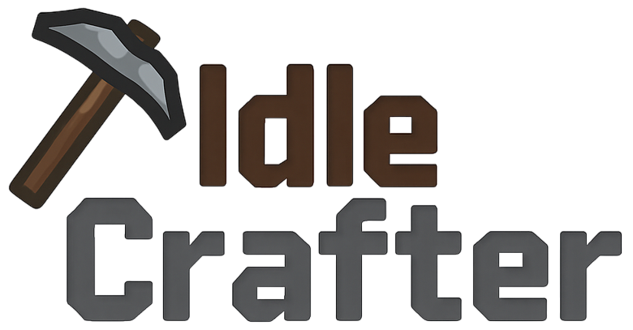

# IdleCrafter

**IdleCrafter** is a mobile idle crafting game where players gather resources, craft tools, upgrade stations, and expand their workshop — all while the game continues progressing even when you're offline.

Inspired by classic crafting systems and idle game mechanics, IdleCrafter blends automation, strategic upgrades, and category-based progression into a clean and rewarding experience.

---

## Features

- 🛠️ Multiple categories: Mining, Woodcutting, Farming, Alchemy, and more
- ⛏️ Tools unlock resource generation every few seconds
- 📦 Inventory system that tracks acquired items and resources
- 📈 XP and level mechanics per category
- ⚙️ Persistent state — progress continues even after closing the app
- 📊 SwiftUI frontend + FastAPI backend + PostgreSQL database

---

## How It Works

- Players **craft tools** (e.g., drills, pickaxes, furnaces) in each category
- Tools produce resources **automatically** at set intervals
- Some resources are **probabilistic**, others require crafted components
- Collected items can be used in **other categories** (e.g., Farming + Alchemy)
- Each action earns **XP**, which levels up the associated category

---

## Technologies

- SwiftUI (frontend)
- FastAPI (backend)
- PostgreSQL (database)
- Docker for environment consistency
- WebSocket support for real-time multiplayer in development

---

## Development Status

This project is in active development and includes:

- ✅ Crafting & tool systems
- ✅ Backend API with user sync
- ✅ Frontend UI with dynamic category views
- 🧩 Coming soon: Marketplace, leaderboard, friends system

---

## 📄 License

This project is licensed under the [MIT License](LICENSE).

---

## 👤 Author

Made with ❤️ by [Emirhan Kartal](https://emirhankartall.com)
